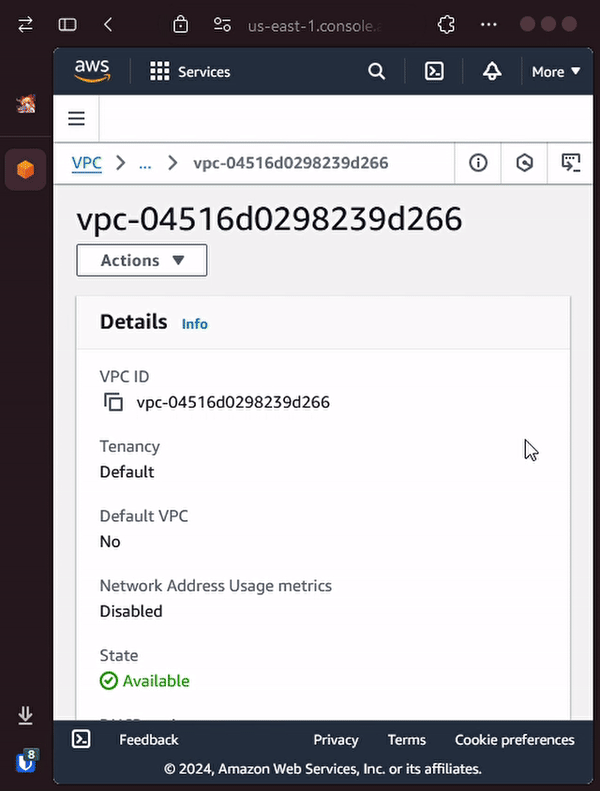

# force_delete (public demo version)
automatically types AWS's delete-safe words 

## demo

## how to use
* [download unsigned .zip file here](https://releases.pmh.codes/force_delete/force_delete_packed.zip)
* open browser's extension settings page
* enable developer mode
* load extension from downloaded file
